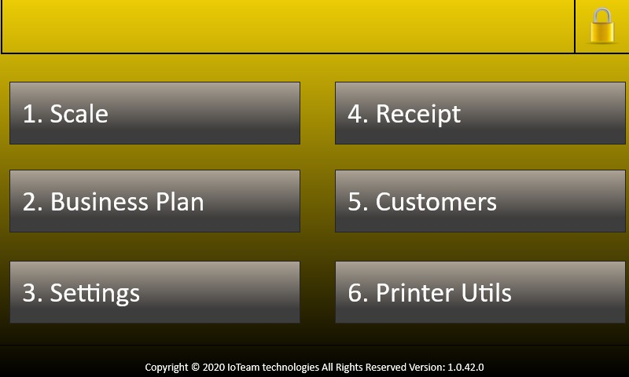

# IoTSuperScale
A Universal Windows Platform (UWP) application targeting on devices with minimum version OS-Windows 10 IoT 10.0.17763. It is a business application implemented and tested on raspberry pi 3B for measuring the weight of products (large packages) and printing labels with a variety of product information. UWP apps are applications that can be used across all compatible Microsoft Windows devices such as tablets, smartphones, Microsoft HoloLens, Internet of Things and of course personal computers. UWP is an API part of Windows 10 and Windows 10 Mobile and support C++, VB, C#, F# and JavaScript.

## Getting Started
Unlike Windows CE of the past, Windows 10 IoT Core is a subset of Windows 10 that is designed to run Windows Universal applications. It is available as a free download and lacks the usual Windows 10 system user interface. As a result this project cost no more than 700&euro; instead of a ready solution that would have at least 7Κ&euro; without license, configuration and maintenance expenses.

### Hardware Requirements
What things you will need to install the software, their costs and how to install them:
|| Component  | Cost |
|--| ------------- | ------------- |
|1.| [Raspberry pi 3B model](https://www.google.com/search?q=raspberry+pi+3+b&tbm=isch&ved=2ahUKEwjyrNqNoMDoAhWLLOwKHYKOCwwQ2-cCegQIABAA&oq=raspberry+pi+3+b&gs_lcp=CgNpbWcQAzIECCMQJzIECCMQJzICCAAyBAgAEB4yBAgAEB4yBAgAEB4yBAgAEB4yBAgAEB4yBAgAEB4yBAgAEB5QsrQDWLK0A2CetgNoAHAAeACAAcABiAHAAZIBAzAuMZgBAKABAaoBC2d3cy13aXotaW1n&sclient=img&ei=geCAXrLoOIvZsAeCna5g&bih=937&biw=1920#imgrc=n8jzdr6hUV6CQM)  | 35&euro;  |
|2.| [Raspberry 7" Official touch screen (Capacitive touch)](https://www.adslgr.com/forum/attachment.php?attachmentid=160698&d=1441707390&thumb=1) | 70&euro;  |
|3.| A microSD card at least 8GB  | 4&euro;-12&euro;  |
|4.| [Load Cell Amplifier HX711](https://www.google.com/search?q=amplifier+hx711&tbm=isch&hl=el&chips=q:amplifier+hx711,online_chips:hx711+load+cells&hl=el&ved=2ahUKEwjAj_esnMDoAhUFeRoKHcRYC60Q4lYoAHoECAEQFQ&biw=1903&bih=937#imgrc=fvOwk2pwjuEr8M)  | 2&euro;  |
|5.| An Indusrtial Load Cell bar  | 120&euro;  |
|6.| An Indusrtial weight platform  | 100&euro;  |
|7.| A Label printer i.e. [Zebra GC420t](https://www.google.com/search?q=zebra+gc420t+google+icons&tbm=isch&ved=2ahUKEwj2kvPmmcDoAhW2wQIHHZYkDRsQ2-cCegQIABAA&oq=zebra+gc420t+google+icons&gs_lcp=CgNpbWcQA1Di9SZYiIInYJaDJ2gAcAB4AIABsAGIAZYGkgEDMC41mAEAoAEBqgELZ3dzLXdpei1pbWc&sclient=img&ei=5dmAXraMObaDi-gPlsm02AE&bih=937&biw=1903&hl=el#imgrc=llM8peIN_1O2qM&imgdii=V2jDth8p1nNchM)  | 250&euro;  |
|8.| [ZebraNet 10/100 Print Server](https://www.google.com/imgres?imgurl=https%3A%2F%2Fcdn11.bigcommerce.com%2Fs-40d25%2Fimages%2Fstencil%2F1280x1280%2Fproducts%2F420%2F1587%2Fzebra-p1031031-zebranet-10-100-external-print-server-supports-the-following-printers-2824-2844-2824z-3842-2844z-105sl-110pax4-110xiiiip_1__41471.1487287824.jpg%3Fc%3D2%26imbypass%3Don&imgrefurl=https%3A%2F%2Fwww.barcodes.com.au%2Fzebra-print-server-external-10-100%2F&tbnid=s8LZkPO-yk5SoM&vet=12ahUKEwi9qrnPmMDoAhWQlRQKHS_XDM4QMygkegQIARBW..i&docid=VH3UMg9CvTczOM&w=1280&h=960&q=server%20printer%20zebra%20gc%20420t&ved=2ahUKEwi9qrnPmMDoAhWQlRQKHS_XDM4QMygkegQIARBW)  | 100&euro; |

### Installing App
These instructions will get you a copy of the project up and running on your local device for development and testing purposes.
Fisrt of all you have to Go to the Windows 10 developer center and Get the Windows 10 IoT Core Dashboard. Select set up device in order to create the OS image of raspberry [(Link to set up device)](https://www.windowscentral.com/how-install-windows-10-iot-raspberry-pi-3). Also about wiring the only important is the connection with amplifier where CLK is wired with GPIO pin23 and DAT is wired with GPIO pin24.

</img>


```C#
public static int ClockPinNumber{
    get{return GetIntSetting("clockPinNumber", 23);}
    set{localSettings.Values["clockPinNumber"] = value;}
}
public static int DataPinNumber{
    get{return GetIntSetting("DataPinNumber", 24);}
    set{localSettings.Values["DataPinNumber"] = value;}
}
```

Clone the project in Visual studio and create the App package by right clicking in solution explorer the .csproj -> Store -> Create App Packages [Package a UWP App](https://docs.microsoft.com/en-us/windows/msix/package/packaging-uwp-apps). For the installation of application you have to go in your Browser type the ip_device:8080 -> credentials device -> Apps -> Apps manager -> Local storage -> Choose file from AppPackages that you create. As you will see the intro page has only weight indicator due to lack of credentials and it is not working because there is no calibration. The login button is dummy so just press it !!

</img> 
</img> 
</img> 

## On Coding side

You will find features such as:
* **Multilingual resources**
* **Connection with the Load cell sensor**

### Receiving data from sensor via amplifier HX711
```C#
while (!IsReady()){
}
string binaryData = "";
for(int pulses = 0; pulses < 25 + (int)InputAndGainSelection ; pulses++)
{
    PowerDownAndSerialClockInput.Write(GpioPinValue.High);
    PowerDownAndSerialClockInput.Write(GpioPinValue.Low);
    if (pulses < 25)
        binaryData += (int)SerialDataOutput.Read();
}
return Convert.ToInt32(binaryData, 2);
}
```
### Transformation of Voltage to Weight value
```C#
voltOutput = _GetOutputData();
//Transform the processed voltage value
double dataOffsetDiff = voltOutput - AppSettings.OffsetZero;
if (AppSettings.CalibrationKilo != 1)
    finalDigitVal = dataOffsetDiff / AppSettings.CalibrationKilo;
else if (AppSettings.CalibrationHalfKilo != 1)
    finalDigitVal = dataOffsetDiff / AppSettings.CalibrationHalfKilo;
finalDigitVal = Math.Round(finalDigitVal, AppSettings.Precision);
finalStringVal = AppSettings.LeadingUnit + Math.Round(finalDigitVal, AppSettings.Precision).ToString() + AppSettings.TrailingUnit;
//Auto correct offset...
if (finalDigitVal < 0.05 && finalDigitVal > -0.05){
    AppSettings.OffsetZero = voltOutput;
    finalStringVal = zeroPointString;
}
return finalStringVal;
```
* **Connection with MS SQL server**
* On having Connection with MS sql server, you have to modify the sql procedures in DBinit class
* **Without SQL Server connection wil retrieve dummy data from JSON files**
* **Connection with Label printer via WiFi Network**

### Sending label file to the printer
```C#
socket = new StreamSocket();
HostName serverHost = new HostName(AppSettings.IpPrinterConfig);
await socket.ConnectAsync(serverHost, AppSettings.PortPrinterConfig);
//send binary readfile to printer
byte[] buffer = new byte[1024];
int readcount = 0;
using (BinaryReader fileReader = new BinaryReader(dataWeightLabel.OpenStreamForReadAsync().GetAwaiter().GetResult()))
{
    int read = fileReader.Read(buffer, 0, buffer.Length);
    while (read > 0)
    {
        readcount += read;
        Stream streamWrite = socket.OutputStream.AsStreamForWrite();
        streamWrite.Write(buffer, 0, read);
        await streamWrite.FlushAsync();
        read = fileReader.Read(buffer, 0, buffer.Length);
    }
}
```
### Great hints on coding the app
* [HX711 amplifier](https://github.com/Pabreetzio/IotScale)
* [On Creating and read files .x and .json](https://docs.microsoft.com/en-us/windows/uwp/files/quickstart-reading-and-writing-files "How to create and read files in UWP")

## Configuration of system
At last the most painful step the configuration of system (Weight calibration, IP printer, Files and SQL Server). First of all from settings menu we calibrate with a standard weight of 1KG or 0,5KG, now the weight indicator is ready. Also we have to set up ip printer from Printer Utils and SQL server from settings menu. Finally in order to access local state of device and modify the default Files (), type in file explorer \\ip_device\c$ and select the path \Data\Users\DefaultAccount \AppData\Local\Packages\Package_name\LocalState

</img> 
</img> 
</img> 

## Happy Birthday!! System in real World!!
</img> 
</img> 

## New features
* Reading weight values from Serial communication 
* Reading DB values from a dedicated Desktop Application 
* Desktop application responsible for controling room automations

## What you have to consider before implementing UWP application on Windows IoT 10
* [Windows 10 IoT](https://docs.microsoft.com/en-us/windows/iot-core/)
* [Performance for UWP](https://docs.microsoft.com/en-us/windows/uwp/debug-test-perf/performance-and-xaml-ui "Performance")
